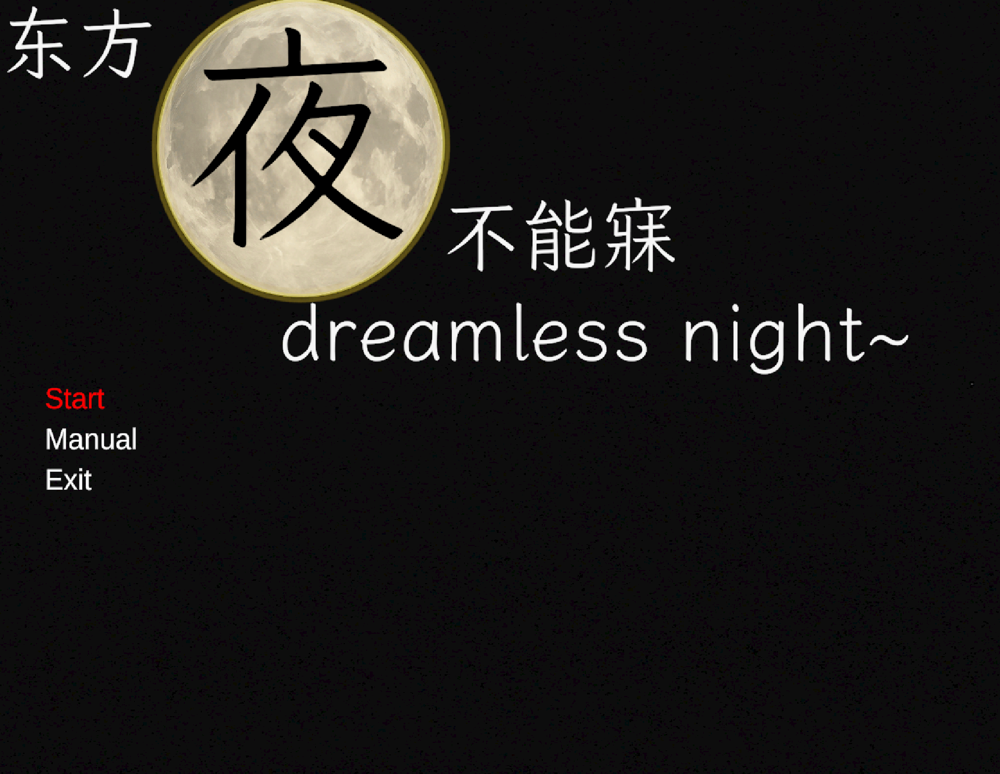
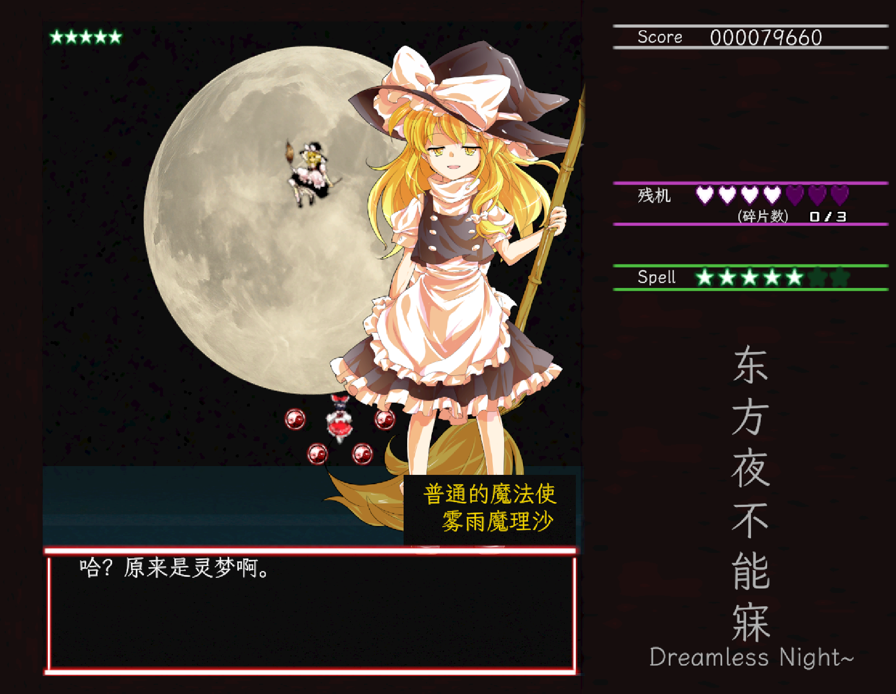

# Touhou Dreamless Night / 东方梦无夜

[English](#english-version) | [中文](#中文说明)

---

## English Version

### Introduction
**Touhou Dreamless Night** is a Unity (C#) bullet-hell game featuring custom **Editor tooling**: a timeline-based stage editor, a **bullet-pattern** authoring tool, and a **boss-behavior** editor (movement/attacks with acceleration and smart chasing). The project emphasizes data-driven design, reusable components, and production-ready UI/FX.

### Key Features
- **Custom Stage Editor**  
  Timeline-based event system with visualized background/audio/enemy events inside Unity Editor.
- **Boss AI & Movement System**  
  Configurable movement steps (Stay, ToFixedPoint, ChasePlayer, SmartChaseRandom), supporting acceleration and intelligent chasing.
- **Bullet System**  
  Pattern-based bullet spawning, disappearing effects, and full-screen bomb clearing mechanism.
- **UI & Cutscenes**  
  Title screen animations, dialogue system (SpriteRenderer + TextMeshPro), and ending sequence.

### Gameplay Preview

#### Title Screen
  

#### Dialogue
  

#### Boss Battle
  

[Watch stage demo on Bilibili](https://www.bilibili.com/video/BV1XTbtzpEXx/)  

### How to Play
- Download the latest build from [Releases](https://github.com/Knotesgit/Touhou-dreamless-night/releases).  
- Extract and run the executable on Windows(MiniTouhouSTG.exe).  

### Credits
- Original assets, characters, and references: ZUN / Touhou Project (Team Shanghai Alice).  
- Music, sound effects, and fonts: see [Credits.txt](./Credit.txt).  
- Tools: [DOTween](http://dotween.demigiant.com/), [LxgwWenKai Font](https://github.com/lxgw/LxgwWenKai).

---

## 中文说明

### 简介
**东方夜不能寐** 是一款基于 Unity (C#) 开发的弹幕射击游戏，具备自定义的 **编辑器工具**：时间轴式关卡编辑器、**弹幕模式**创作工具，以及 **Boss 行为**编辑器（移动/攻击，支持加速度与智能追踪玩家）。本项目强调 **数据驱动设计**、**可复用组件**，以及 **UI/特效**。

### 技术亮点
- **关卡编辑器**  
  基于时间轴的事件系统，支持背景切换、音效播放、敌人出场的可视化编辑。  
- **Boss 行为系统**  
  可配置移动步骤（停留、定点移动、追踪玩家、智能追踪），支持加速度和伪随机追踪逻辑。  
- **弹幕系统**  
  支持自定义 Pattern，包含子弹消失特效与全屏 Bomb 清屏机制。  
- **UI 与演出**  
  标题界面动画、对白系统（SpriteRenderer+TextMeshPro）与结局演出。  

### 游戏预览

#### 标题界面
  

#### 对话
  

#### Boss 战
  

[道中实机演示（Bilibili）](https://www.bilibili.com/video/BV1XTbtzpEXx/)

### 运行方式
- 在 [Releases](https://github.com/Knotesgit/Touhou-dreamless-night/releases) 页面下载最新版本，解压后运行 Windows 可执行文件(MiniTouhouSTG.exe)。  

### 致谢
- 原作素材、角色版权：ZUN / 东方 Project（上海爱丽丝幻乐团）  
- 音乐、音效、字体：详见 [Credits.txt](./Credit.txt)  
- 插件与工具：DOTween、霞鹜文楷字体  

